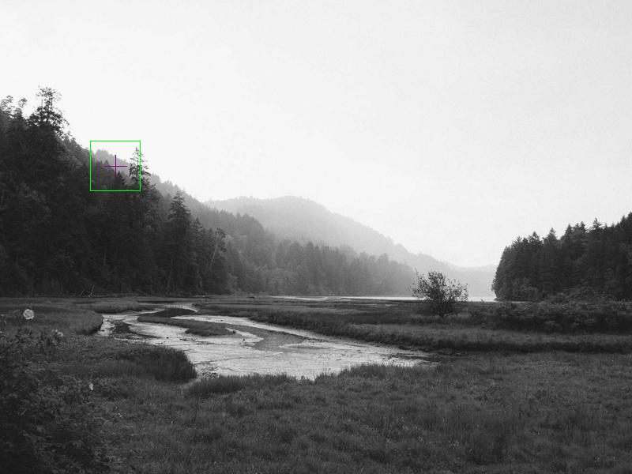
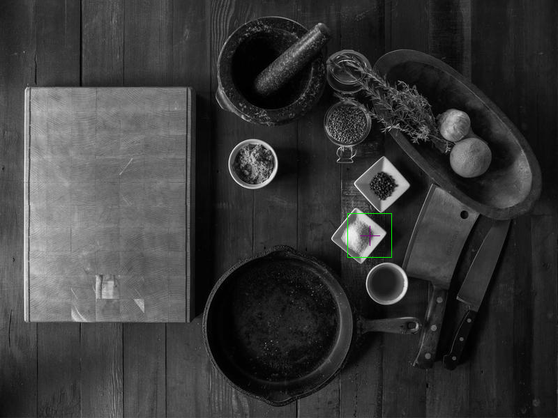
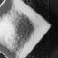
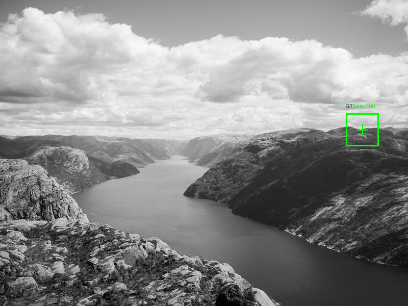
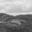

# Vulkan Tensorial Template Matching - Visual Proof

**Generated:** 2026-03-14 10:02:37

## Methodology

This proof uses **verified ground truth**:
1. For each source image, find a distinctive location (high variance)
2. Extract a 64×64 template from that location
3. **Verify** Vulkan TTM can find it back (< 10px error, correlation > 0.7)
4. Only include cases that pass verification
5. Ground truth is the **exact extraction location**

## Summary Table

| Case | Image | Vulkan Corr | Distance | Duration | Status |
|------|-------|-------------|----------|----------|--------|
| 0 | source_4.png | 1.000 | 0.0px | 62.6ms | ✓ |
| 1 | source_0.png | 1.000 | 0.0px | 35.1ms | ✓ |
| 2 | source_5.png | 1.000 | 0.0px | 62.2ms | ✓ |
| 3 | source_1.png | 1.000 | 0.0px | 51.1ms | ✓ |

---

### Case 0: source_4.png

**Ground Truth**: top-left=(114, 178), centre=(146, 210)

**Vulkan TTM Result**:
- Position: (146, 210)
- Correlation: 1.000
- Rotation: 0.0°
- Distance from GT: 0.0px
- Duration: 62.6ms

---

### Case 1: source_0.png

**Ground Truth**: top-left=(498, 306), centre=(530, 338)

**Vulkan TTM Result**:
- Position: (530, 338)
- Correlation: 1.000
- Rotation: 0.0°
- Distance from GT: 0.0px
- Duration: 35.1ms

---

### Case 2: source_5.png

**Ground Truth**: top-left=(562, 178), centre=(594, 210)

**Vulkan TTM Result**:
- Position: (594, 210)
- Correlation: 1.000
- Rotation: 0.0°
- Distance from GT: 0.0px
- Duration: 62.2ms

---

### Case 3: source_1.png

**Ground Truth**: top-left=(306, 242), centre=(338, 274)

**Vulkan TTM Result**:
- Position: (338, 274)
- Correlation: 1.000
- Rotation: 0.0°
- Distance from GT: 0.0px
- Duration: 51.1ms

---

